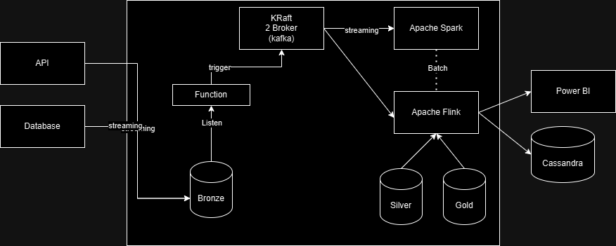

# Data Lakehouse 

Use for big data streaming and processing.
A data lakehouse with medallion architecture that use minio, apache spark, apache flink and cloud function in python.

`These repo are for testing purpose for streaming millions of record with parquet`, refer the complete one to /Data-Lakehouse-complete without Apache Flink

This repository contains a Data Lakehouse with Medallion architecture that uses MinIO for object storage, Apache Spark for data processing, Apache Flink for data streaming and Cloud Function in Python for data ingestion and data processing. This repository is a proof of concept and is not intended for production use.

## Requirements
- At least 8Gb RAM of Memory on Linux

## Todo 

- use python 3.11
- Consume with apache spark for streaming
- Consume with apache flink for batch processing

